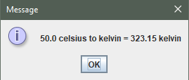

 

   
   

## Table of content 📑
* [Tittle](#Título-e-imagen-de-portada)
* [Badges](#insignias)
* [Table of content](#Table-of-content)
* [Project description](#Project-description)
* [Project status](#Projectstatus)
* [Application features and demonstration](#Application-features-and-demonstration)
* [Access to project](#Access-to-project)
* [Tecnologías utilizadas](#tecnologías-utilizadas)
* [Developers](#Developers)

## Project Description 📝

This is a simple currency and temperature converter application developed in Java. The application allows users to convert Colombian pesos to dollars, euros, yen, won, and British pounds, as well as vice versa. Additionally, it provides a temperature conversion feature. The project follows the object-oriented programming paradigm and utilizes Java's JOptionPane for the user interface.

## Project Status ✔️

The project is currently completed and is actively maintained.

## Application Features and Demonstration

### Currency Conversion 💱

- Convert Colombian Pesos to Dollars
- Convert Colombian Pesos to Euros
- Convert Colombian Pesos to Yen
- Convert Colombian Pesos to Won
- Convert Colombian Pesos to British Pounds

### Reverse Currency Conversion 

- Convert Dollars to Colombian Pesos
- Convert Euros to Colombian Pesos
- Convert Yen to Colombian Pesos
- Convert Won to Colombian Pesos
- Convert British Pounds to Colombian Pesos

### Temperature Conversion 🎆

- Convert Celsius to Fahrenheit
- Convert Celsius to Kelvin
- Convert Fahrenheit to Celsius
- Convert Fahrenheit to Kelvin
- Convert Kelvin to Celsius
- Convert Kelvin to Fahrenheit

### Demonstration 👀
next I will put some screenshots to show you step by step how the application works.
* first, choose what do you want convert  
    
* Next, enter the value to convert   
    
    
* Then, choose the option to convert   
    
    
* Finally, check a message with your answer  
    
    

## Access to Project 🗝️

To access the project or contribute to it, visit the 🔗 [GitHub Repository](https://github.com/CristianLopez3/Converter).

## Technologies Used 💻

The project was developed using the following technologies:

- Java
- Java's JOptionPane

## Developers 👨‍💻

This project was developed by Cristian Lopez.    

<a href="https://www.linkedin.com/in/cristian-lopez-software/"> <a>
<a href="https://github.com/CristianLopez3"> <a>

